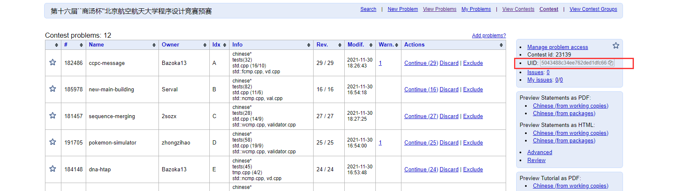
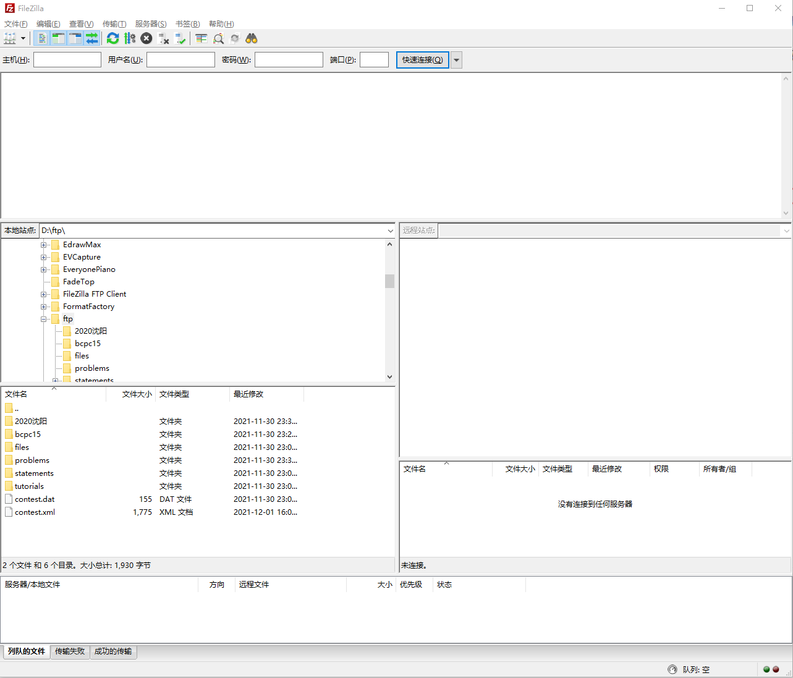
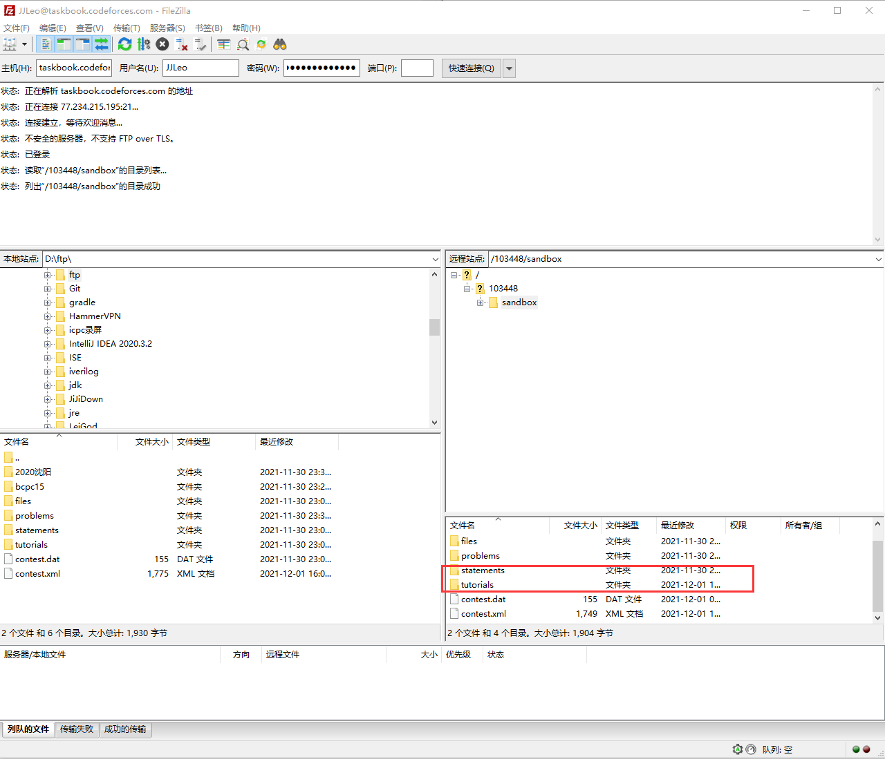
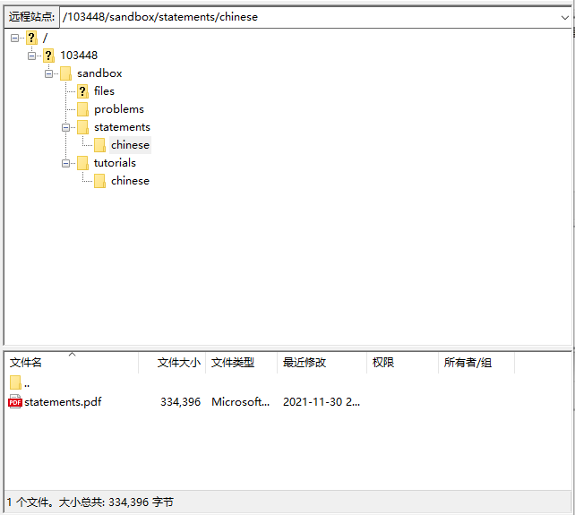
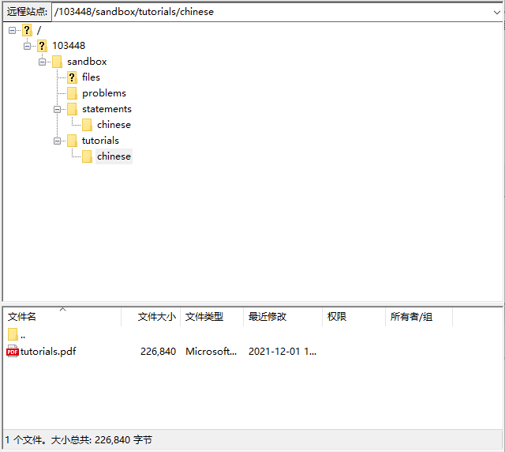
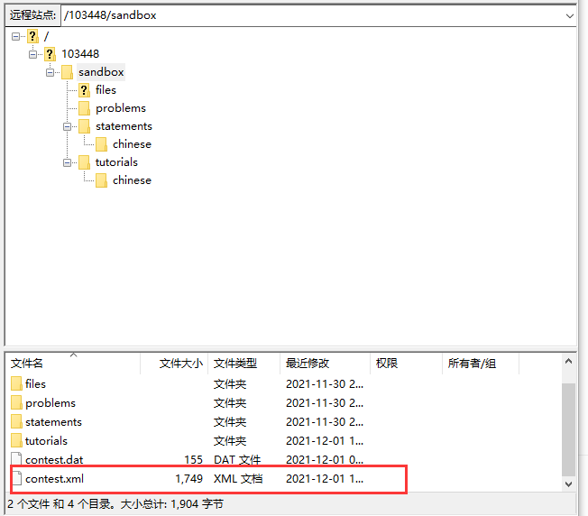
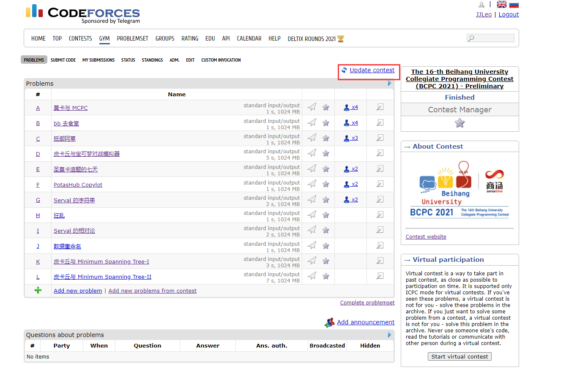
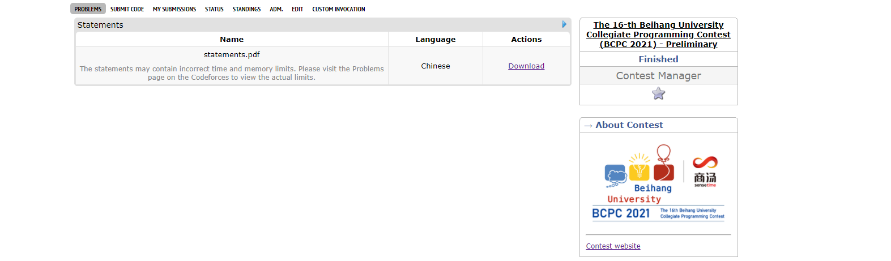
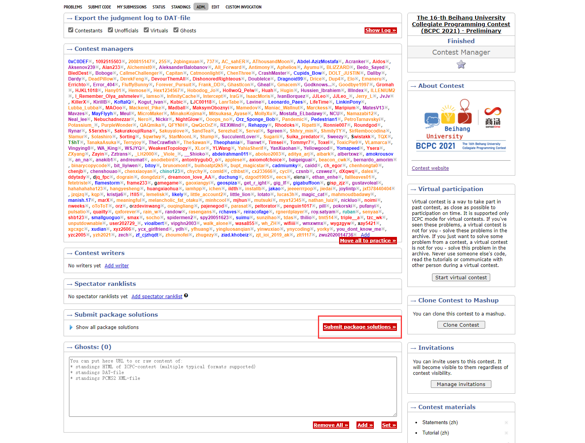
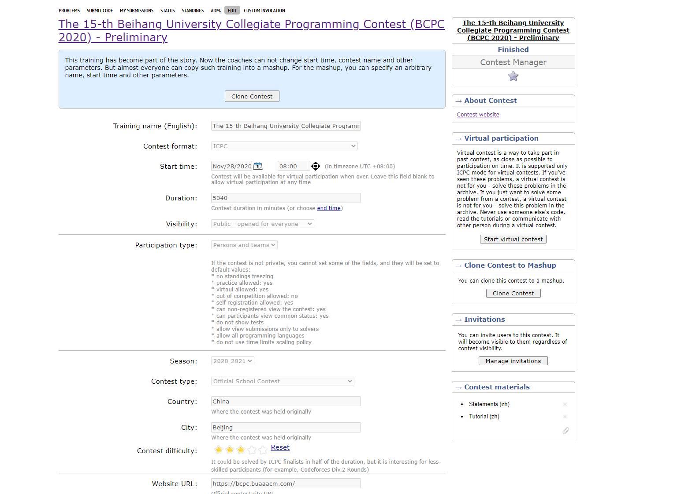

# 上传题目到 Gym 的相关事宜

## 把 Polygon 的题目上传到 Codeforces Gym 上

1. 在 Polygon 对应比赛中，点右下角的 Manage developers list，将 `codeforces` 加入 Change list，Access 设为 `WRITE`。之后可以看到 `Codeforces Judge System` 出现在了 Contest developers 中。

2. 进入 Codeforces Gym，点击 Create new training，设置比赛相关信息，如果要公开需要将 Visibility 设为 `Public`。

3. 此时得到一个空的 Gym 比赛，在 problems 界面点击绿色加号右边的 Add new problems from contest，将 polygon 对应比赛的 UID 粘贴到这里，点击 Download contest problems 即可完成题目上传。UID 具体位置如下：

   

## 将 Statements 和 Tutorials 上传到 Codeforces Gym 上

1. 下载一个 FTP 连接工具，下面以 FileZella 为例，百度就可以下载免费版。

2. 打开后这个软件长下面这样：

   

   主机名填写 ftp://taskbook.codeforces.com/103448/sandbox，注意要把 103448 替换成对应 gym 的编号。

   用户名填写 codeforces 的 handle，密码填写这个 handle 的密码。

   点击快速连接。

3. 连上后长这样：

   

   红框两个文件夹是放题面和题解的，具体的放置文件结构如下，如果要其它语言就把 chinese 改成其它语言：

   

   

4. 把两个 pdf 文件上传后，回到 sandbox 目录，找到 `contest.xml` 这个文件：

   

   原本它应该长这样，当然具体比赛名字和题目链接会不同：

   ```xml
   <?xml version="1.0" encoding="utf-8" standalone="yes"?>
   <contest>
       <names>
           <name language="english" main="true" value="The 16-th Beihang University Collegiate Programming Contest (BCPC 2021) - Preliminary"/>
       </names>
       <problems languages="chinese">
           <problem index="A" url="https://polygon.codeforces.com/p5BndsN/Bazoka13/ccpc-message"/>
           <problem index="B" url="https://polygon.codeforces.com/p2Zthbq/Serval/new-main-building"/>
           <problem index="C" url="https://polygon.codeforces.com/p9SzEIP/2sozx/sequence-merging"/>
           <problem index="D" url="https://polygon.codeforces.com/p5uZt0A/zhongzihao/pokemon-simulator"/>
           <problem index="E" url="https://polygon.codeforces.com/p7ZOQpi/Bazoka13/dna-htap"/>
           <problem index="F" url="https://polygon.codeforces.com/p3vpRzz/nikkukun/potashub-copylot"/>
           <problem index="G" url="https://polygon.codeforces.com/p5qcqF5/Serval/repeat-and-match"/>
           <problem index="H" url="https://polygon.codeforces.com/p4eLkoH/absi2011/hysteria"/>
           <problem index="I" url="https://polygon.codeforces.com/p9auLjX/Serval/theory-of-relativity"/>
           <problem index="J" url="https://polygon.codeforces.com/p04TsJF/nikkukun/rename"/>
           <problem index="K" url="https://polygon.codeforces.com/p4OkUE9/zhongzihao/minimum-spanning-tree-i"/>
           <problem index="L" url="https://polygon.codeforces.com/p4wywOF/zhongzihao/minimum-spanning-tree-ii"/>
       </problems>
   </contest>
   
   ```

   在其中加入这几行，变成这样：

   ```xml
   <?xml version="1.0" encoding="utf-8" standalone="yes"?>
   <contest>
       <names>
           <name language="english" main="true" value="The 16-th Beihang University Collegiate Programming Contest (BCPC 2021) - Preliminary"/>
       </names>
   	<statements>
           <statement language="chinese" path="statements/chinese/statements.pdf" type="application/pdf"/>
       </statements>
   	<tutorials>
           <tutorial language="chinese" path="tutorials/chinese/tutorials.pdf" type="application/pdf"/>
       </tutorials>
       <problems languages="chinese">
           <problem index="A" url="https://polygon.codeforces.com/p5BndsN/Bazoka13/ccpc-message"/>
           <problem index="B" url="https://polygon.codeforces.com/p2Zthbq/Serval/new-main-building"/>
           <problem index="C" url="https://polygon.codeforces.com/p9SzEIP/2sozx/sequence-merging"/>
           <problem index="D" url="https://polygon.codeforces.com/p5uZt0A/zhongzihao/pokemon-simulator"/>
           <problem index="E" url="https://polygon.codeforces.com/p7ZOQpi/Bazoka13/dna-htap"/>
           <problem index="F" url="https://polygon.codeforces.com/p3vpRzz/nikkukun/potashub-copylot"/>
           <problem index="G" url="https://polygon.codeforces.com/p5qcqF5/Serval/repeat-and-match"/>
           <problem index="H" url="https://polygon.codeforces.com/p4eLkoH/absi2011/hysteria"/>
           <problem index="I" url="https://polygon.codeforces.com/p9auLjX/Serval/theory-of-relativity"/>
           <problem index="J" url="https://polygon.codeforces.com/p04TsJF/nikkukun/rename"/>
           <problem index="K" url="https://polygon.codeforces.com/p4OkUE9/zhongzihao/minimum-spanning-tree-i"/>
           <problem index="L" url="https://polygon.codeforces.com/p4wywOF/zhongzihao/minimum-spanning-tree-ii"/>
       </problems>
   </contest>
   
   ```

   再把这个文件传回去覆盖原来的文件。

5. 回到 Gym 比赛里面，点击这个 Update Contest 按钮，加载完成后即可看到题面和题解：

   

   > 已知 bug：如果 polygon 上有 Java 11 的提交，会报错，解决方法是改成 Java 8 或者删掉。

## 将 Codeforces Gym 题目设置为 PDF 题面

如果题面中用到了 HTML 没法渲染的东西，codeforces 题面会裂开，这时可以用这个方法使得点击题目后直接跳转到如下这个界面，让选手直接去看 pdf 题面：



将上述过程中 `contest.xml` 进行更改，选择一个题面不支持的语言，例如中文题面可以选择 english，将 `<problems languages="chinese">` 改为 `<problems languages="english">`，这样 codeforces 就会认为没有合适的 HTML 题面，从而直接跳转到上述界面，改完后的 `contest.xml` 如下：

```xml
<?xml version="1.0" encoding="utf-8" standalone="yes"?>
<contest>
    <names>
        <name language="english" main="true" value="The 16-th Beihang University Collegiate Programming Contest (BCPC 2021) - Preliminary"/>
    </names>
	<statements>
        <statement language="chinese" path="statements/chinese/statements.pdf" type="application/pdf"/>
    </statements>
	<tutorials>
        <tutorial language="chinese" path="tutorials/chinese/tutorials.pdf" type="application/pdf"/>
    </tutorials>
    <problems languages="english">
        <problem index="A" url="https://polygon.codeforces.com/p5BndsN/Bazoka13/ccpc-message"/>
        <problem index="B" url="https://polygon.codeforces.com/p2Zthbq/Serval/new-main-building"/>
        <problem index="C" url="https://polygon.codeforces.com/p9SzEIP/2sozx/sequence-merging"/>
        <problem index="D" url="https://polygon.codeforces.com/p5uZt0A/zhongzihao/pokemon-simulator"/>
        <problem index="E" url="https://polygon.codeforces.com/p7ZOQpi/Bazoka13/dna-htap"/>
        <problem index="F" url="https://polygon.codeforces.com/p3vpRzz/nikkukun/potashub-copylot"/>
        <problem index="G" url="https://polygon.codeforces.com/p5qcqF5/Serval/repeat-and-match"/>
        <problem index="H" url="https://polygon.codeforces.com/p4eLkoH/absi2011/hysteria"/>
        <problem index="I" url="https://polygon.codeforces.com/p9auLjX/Serval/theory-of-relativity"/>
        <problem index="J" url="https://polygon.codeforces.com/p04TsJF/nikkukun/rename"/>
        <problem index="K" url="https://polygon.codeforces.com/p4OkUE9/zhongzihao/minimum-spanning-tree-i"/>
        <problem index="L" url="https://polygon.codeforces.com/p4wywOF/zhongzihao/minimum-spanning-tree-ii"/>
    </problems>
</contest>

```

再把这个文件传回去覆盖原来的文件，并点击上述所说的 Update Contest 按钮即可。

## 将所有 Polygon 提交在 Codeforces Gym 上交一遍

在 Coach Mode 下的 ADM. 界面，点击如下按钮 Submit package solutions 即可：



## 导入榜单

还不会，待学习。

## Gym 的奇怪机制

一定时间后一个 Gym 就会变成如下形式：



此时无法进行任何更改，除了各种信息不能改外，上述的 Update Contest 按钮也没了，因此题面和题解什么的要赶快传。

此外，即使 Gym 变成这种形式，还是可以在 ADM. 界面进行导入榜单的。
